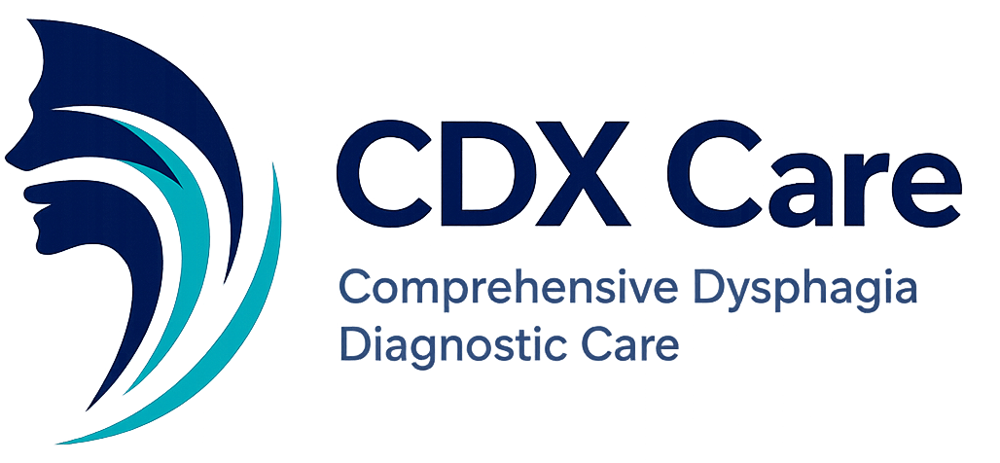

# Michael Palmer

Director of Technology Operations  
CDX Care

Building technology, infrastructure, and systems that support better healthcare delivery.

---

## Current Focus

- Technology Operations at CDX Care
- Healthcare workflow and diagnostic platforms
- Cloud infrastructure and automation
- Security and device management
- Modern web and application development

## Technologies

- Kotlin
- Java
- Python
- Rust
- AWS
- Docker
- Linux
- Microsoft 365
- Cloudflare

## Projects

### CDX Care

Comprehensive Dysphagia Diagnostic Care (CDX Care) is dedicated exclusively to dysphagia diagnostics, bringing advanced diagnostic services directly to patients through portable technology and collaborative healthcare partnerships.

### Areas of Interest

- Healthcare Technology
- Cloud Infrastructure
- Automation
- Security
- Developer Productivity
- Open Source Software

---

🌐 Website: https://www.cdxcare.com
